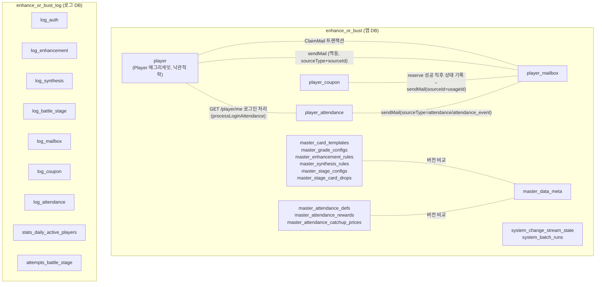

# 04_DATA_MODEL.md

MongoDB 컬렉션 구조와 원자성 경계. 상세 원칙(왜 이렇게 나눴는지)은 루트 `CLAUDE.md`의
"MongoDB 데이터 모델링 / 원자성 전략" 절이 원본이다 — 이 문서는 그 결과물인 실제 컬렉션
목록과 관계를 한눈에 보기 위한 다이어그램이다.

## DB 물리 분리

앱 DB(`enhance_or_bust`)와 로그 DB(`enhance_or_bust_log`)는 별도 MongoDB 데이터베이스다
(같은 replica set 안이지만 물리적으로 분리된 논리 DB — 트랜잭션으로 묶이지 않는다).



메인 트랜잭션(player/player_mailbox)은 로그 DB 쓰기 실패와 절대 묶이지 않는다 — 로그 기록은
try/catch로 감싸 실패를 삼키고 log4js에만 남긴다.

## player 컬렉션 (Player 애그리게잇, 단일 문서 + 낙관적 락)

```
player/{playerId}
├─ platformType, platformUserId   (복합 unique 인덱스)
├─ name, picture
├─ version                         (낙관적 락 카운터)
├─ economy: { gold, enhancementStone, diamond }
├─ clearedStage
└─ inventory: [
     { cardId, templateId, level, exp, enhancementLevel }, ...
   ]
```

- 강화/합성은 `inventory` 배열의 `$pull`/`$push` + `economy` 필드를 **한 번의 조건부
  업데이트**(`version` 일치 조건)로 같이 바꾼다 — Inventory/Progression/Economy가 이미
  하나의 애그리게잇인 이유.
- `Battle-Stage`는 `clearedStage` 필드만 이 문서에 저장한다. 전투 판정 자체(카드 스탯
  합산 vs 몬스터)는 저장 없는 순수 계산.

## player_mailbox 컬렉션 (별도 컬렉션)

```
player_mailbox/{mailId}
├─ playerId
├─ title, attachments: { gold?, enhancementStone?, diamond?, cardTemplateIds? }
├─ sourceType, sourceId            (복합 unique 인덱스 — 멱등 발송)
├─ createdAt, expiresAt, claimedAt, deletedAt
```

- **발송(SendMail)**: player 갱신 성공 → player_mailbox insert. 재시도 시 `(sourceType,
  sourceId)` unique 인덱스가 중복 삽입을 막는다(트랜잭션 대신 멱등키 방식).
- **수령(ClaimMail)**: player_mailbox 상태 변경 + player 지급을 멀티도큐먼트 **트랜잭션**으로
  묶는다 — 두 컬렉션에 걸친 유일한 쓰기라 트랜잭션이 필요한 케이스.
- **삭제**는 `deletedAt` 플래그만(하드 삭제 아님), 만료 정리 배치만 실제 물리 삭제.

## player_coupon 컬렉션 (별도 컬렉션)

```
player_coupon/{usageId}    (_id = coupon_platform의 coupon_code_usage_id)
├─ playerId, code, attachments
├─ reservedAt
├─ mailGrantedAt                  (null이면 아직 우편 미발송)
└─ confirmedAt                    (null이면 아직 confirm 미보고)
```

- coupon_platform `reserve()` 성공 직후 가장 먼저 이 레코드부터 남긴다 — 이후 우편 발송/
  confirm 보고 중 어느 단계에서 죽어도 재처리 배치가 `mailGrantedAt`/`confirmedAt`만 보고
  정확히 이어서 처리할 수 있다. 우편의 `sourceId`로 `_id`(usageId)를 그대로 써서 SendMail의
  멱등 발송과 사슬로 엮인다. 상세는 `20_COUPON_PLATFORM_INTEGRATION.md` 참고.

## player_attendance 컬렉션 (별도 컬렉션)

```
player_attendance/{instanceId}
├─ playerId, defId                 (복합 unique 인덱스 — (playerId, defId)당 문서 1개만 유지)
├─ type                            (GENERAL | EVENT)
├─ snapshot: { durationDays, catchupMaxCount, rewards[], catchupPrices[] }   (발급 시점 스냅샷)
├─ rotationCount                   (로테이션마다 +1, 최초 발급 1)
├─ catchupPurchaseCount
├─ startDate, endDate              (로컬 YYYY-MM-DD)
├─ attendedDays: number[]          ($addToSet으로만 추가)
└─ status                          (ACTIVE | COMPLETED)
```

- 로테이션(GENERAL 재발급, `maxRotationCount` 이내)마다 새 문서를 쌓지 않고 **같은 문서를
  in-place로 리셋**해 재사용한다 — 컬렉션이 무한히 커지는 것을 막기 위한 설계. 리셋 직전
  옛 사이클의 최종 상태는 `log_attendance`의 `action:"reset"`에 남는다.
- 보상 지급(`GET /player/me` 로그인 처리 중 자동 지급, 또는 캐치업 구매)은 player_mailbox로
  발송한다 — SendMail 멱등키(`sourceType: "attendance"|"attendance_event"`, `sourceId:
  "{playerId}_{defId}_{day}"`)로 중복 지급을 막는다. 캐치업 구매만 player(골드 차감)+
  player_mailbox(보상)+player_attendance(출석 처리) 3개 컬렉션을 세션 트랜잭션으로 묶는다.
- 상세는 `23_GAME_DESIGN_ATTENDANCE.md`.

## 마스터 데이터 (콘텐츠, `master_` 프리픽스)

`master_card_templates`/`master_grade_configs`/`master_enhancement_rules`/
`master_synthesis_rules`/`master_stage_configs`/`master_stage_card_drops`/
`master_attendance_defs`/`master_attendance_rewards`/`master_attendance_catchup_prices` —
컨텐츠별 별도 컬렉션. 각 문서는 독립적인 `version` 필드를 갖고, DB 버전은 `master_data_meta`
(`{content, version}` 1문서씩)에서 관리한다. 서버는 전체를 메모리 싱글톤 캐시로
로드하고, Change Stream(주 채널) + 주기적 폴링(fallback)으로 리로드한다. 출석 정의 3종은
현재 `npm run seed`(`seedMasterData.ts`)로만 적재된다 — gm_platform 쪽은 조회 API
(`get-attendance-defs`/`-rewards`/`-catchup-prices`)만 구현되어 있고 저장(쓰기) API는
아직 없다(`17_GM_API.md`).

## 시스템 상태 (`system_` 프리픽스, 콘텐츠도 플레이어 데이터도 아님)

- `system_change_stream_state` — 마스터 데이터 워처의 resume token(단일 문서)
- `system_batch_runs` — 배치 중복 실행 방지 마커(`{jobName}:{period}`를 `_id`로 유니크
  삽입)

## 로그 DB (`enhance_or_bust_log`)

- **감사 로그**(상태 변경 액션 추적): `log_auth`/`log_enhancement`/`log_synthesis`/
  `log_battle_stage`/`log_mailbox`/`log_coupon`/`log_attendance` — 공통 스키마
  `{actorId, action, changes, occurredAt}`. 상세 정책은 `08_AUDIT_LOG_POLICY.md`.
- **DAU**: `stats_daily_active_players` — `(playerId, date)` unique, 감사 로그와 무관한
  별도 집계.
- **전투 통계**: `attempts_battle_stage` — 승패 무관 매 시도 기록(승률/카드 조합 분석용,
  `log_battle_stage`는 승리 시에만 기록되어 목적이 다름).

로그 테이블엔 FK를 걸지 않는다(물리적으로 분리된 DB라 애초에 걸 수 없음).
