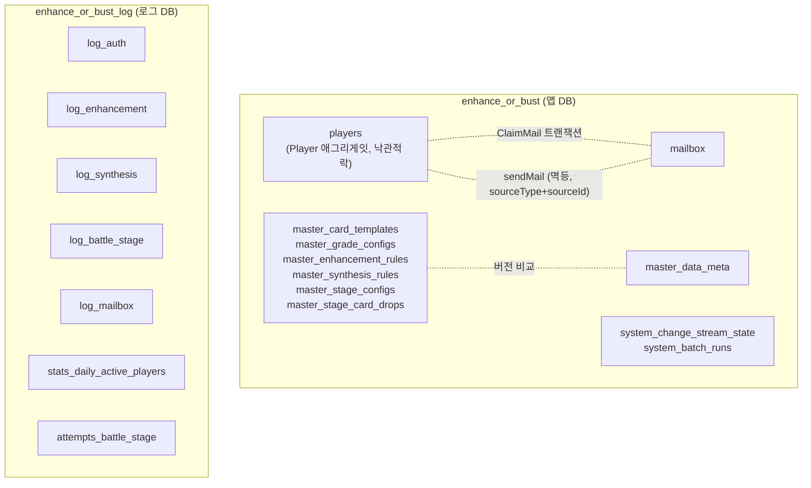

# 04_DATA_MODEL.md

MongoDB 컬렉션 구조와 원자성 경계. 상세 원칙(왜 이렇게 나눴는지)은 루트 `CLAUDE.md`의
"MongoDB 데이터 모델링 / 원자성 전략" 절이 원본이다 — 이 문서는 그 결과물인 실제 컬렉션
목록과 관계를 한눈에 보기 위한 다이어그램이다.

## DB 물리 분리

앱 DB(`enhance_or_bust`)와 로그 DB(`enhance_or_bust_log`)는 별도 MongoDB 데이터베이스다
(같은 replica set 안이지만 물리적으로 분리된 논리 DB — 트랜잭션으로 묶이지 않는다).



메인 트랜잭션(players/mailbox)은 로그 DB 쓰기 실패와 절대 묶이지 않는다 — 로그 기록은
try/catch로 감싸 실패를 삼키고 log4js에만 남긴다.

## players 컬렉션 (Player 애그리게잇, 단일 문서 + 낙관적 락)

```
players/{playerId}
├─ platformType, platformUserId   (복합 unique 인덱스)
├─ name, picture
├─ version                         (낙관적 락 카운터)
├─ economy: { gold, enhancementStone, diamond }
├─ clearedStage
└─ inventory: [
     { cardId, templateId, level, exp, enhancementLevel }, ...
   ]
```

- 강화/합성은 `inventory` 배열의 `$pull`/`$push` + `economy` 필드를 **한 번의 조건부
  업데이트**(`version` 일치 조건)로 같이 바꾼다 — Inventory/Progression/Economy가 이미
  하나의 애그리게잇인 이유.
- `Battle-Stage`는 `clearedStage` 필드만 이 문서에 저장한다. 전투 판정 자체(카드 스탯
  합산 vs 몬스터)는 저장 없는 순수 계산.

## mailbox 컬렉션 (별도 컬렉션)

```
mailbox/{mailId}
├─ playerId
├─ title, attachments: { gold?, enhancementStone?, diamond?, cardTemplateIds? }
├─ sourceType, sourceId            (복합 unique 인덱스 — 멱등 발송)
├─ createdAt, expiresAt, claimedAt, deletedAt
```

- **발송(SendMail)**: players 갱신 성공 → mailbox insert. 재시도 시 `(sourceType,
  sourceId)` unique 인덱스가 중복 삽입을 막는다(트랜잭션 대신 멱등키 방식).
- **수령(ClaimMail)**: mailbox 상태 변경 + players 지급을 멀티도큐먼트 **트랜잭션**으로
  묶는다 — 두 컬렉션에 걸친 유일한 쓰기라 트랜잭션이 필요한 케이스.
- **삭제**는 `deletedAt` 플래그만(하드 삭제 아님), 만료 정리 배치만 실제 물리 삭제.

## 마스터 데이터 (콘텐츠, `master_` 프리픽스)

`master_card_templates`/`master_grade_configs`/`master_enhancement_rules`/
`master_synthesis_rules`/`master_stage_configs`/`master_stage_card_drops` — 컨텐츠별 별도
컬렉션. 각 문서는 독립적인 `version` 필드를 갖고, DB 버전은 `master_data_meta`
(`{content, version}` 1문서씩)에서 관리한다. 서버는 전체를 메모리 싱글톤 캐시로
로드하고, Change Stream(주 채널) + 주기적 폴링(fallback)으로 리로드한다.

## 시스템 상태 (`system_` 프리픽스, 콘텐츠도 플레이어 데이터도 아님)

- `system_change_stream_state` — 마스터 데이터 워처의 resume token(단일 문서)
- `system_batch_runs` — 배치 중복 실행 방지 마커(`{jobName}:{period}`를 `_id`로 유니크
  삽입)

## 로그 DB (`enhance_or_bust_log`)

- **감사 로그**(상태 변경 액션 추적): `log_auth`/`log_enhancement`/`log_synthesis`/
  `log_battle_stage`/`log_mailbox` — 공통 스키마 `{actorId, action, changes, occurredAt}`.
  상세 정책은 `08_AUDIT_LOG_POLICY.md`.
- **DAU**: `stats_daily_active_players` — `(playerId, date)` unique, 감사 로그와 무관한
  별도 집계.
- **전투 통계**: `attempts_battle_stage` — 승패 무관 매 시도 기록(승률/카드 조합 분석용,
  `log_battle_stage`는 승리 시에만 기록되어 목적이 다름).

로그 테이블엔 FK를 걸지 않는다(물리적으로 분리된 DB라 애초에 걸 수 없음).
