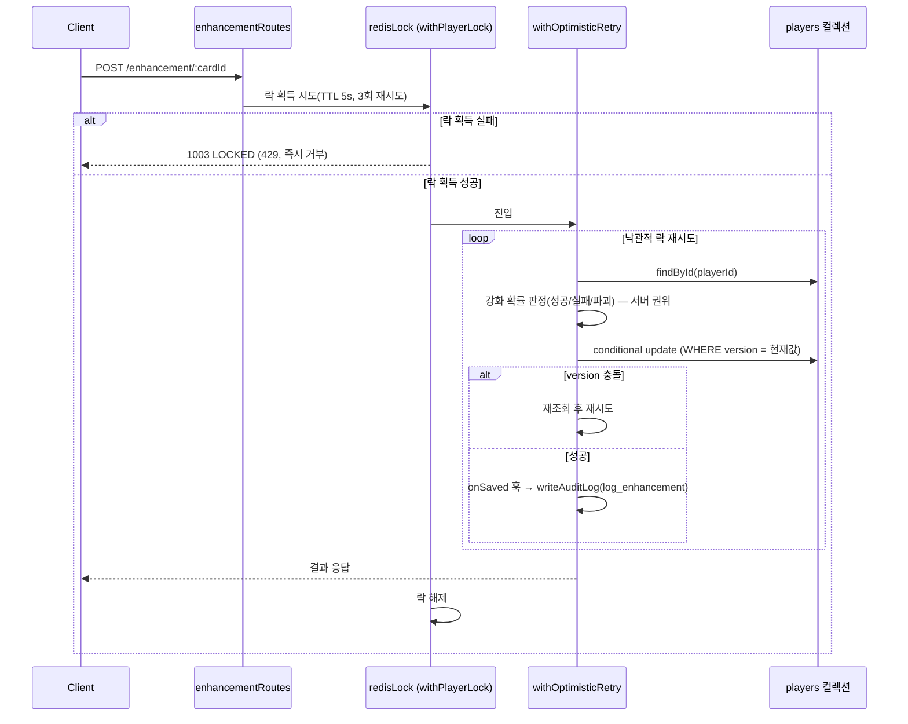

# 06_ENHANCEMENT_SYNTHESIS_SCENARIO.md

강화/합성이 공유하는 동시성 처리 흐름. 두 컨텍스트 모두 "같은 플레이어 문서를 낙관적
락으로 재조회·재시도"하는 구조가 동일해 `shared-kernel/optimisticPlayerWrite.ts`의
`withOptimisticRetry()` 공용 헬퍼로 통합되어 있다.

## 왜 이렇게 설계했는가

- **낙관적 락(`players.version`)만으로는 충분하지 않다** — 같은 플레이어가 강화 버튼을
  연타하면 매 요청이 낙관적 락 충돌 → 재조회 → 재시도를 반복해, 요청이 몰릴수록 DB
  부하가 기하급수적으로 늘어난다(재시도 폭주).
- **해결**: Redis 짧은 TTL 락(`redisLock.ts`의 `withPlayerLock()`, 플레이어 단위, TTL
  5초)으로 전체를 감싸 동시 요청 자체를 직렬화한다. 락 획득에 실패하면(짧게 3회·150ms
  간격 재시도 후 포기) 대기시키지 않고 즉시 `COMMON.LOCKED`(1003, 429)로 거부한다
  (fail-fast) — 정합성은 이미 `version` 낙관적 락이 보장하므로, 이 Redis 락은 순수
  부하 최적화다. 대기시켜 처리량을 늘리는 대신 연타 자체를 막는 쪽을 택했다.

## 흐름 (강화 예시, 합성도 동일 패턴)

- 재시도 상한을 넘기면 `COMMON.CONFLICT`(1002, 409)로 실패한다.
- `onSaved` 훅은 저장이 실제로 성공했을 때만 호출되므로, 감사 로그가 재시도 중간의
  실패한 시도까지 중복으로 남기지 않는다.

## 합성과의 차이점

| | 강화(Enhancement) | 합성 — gradeUpgrade | 합성 — enhanceMaterial |
|---|---|---|---|
| 소모 카드 수 | 0(대상 카드 자체) | 동일 등급 3장 | 대상 외 동일 원형 2장 + 골드 |
| 성공률 | 강화 단계 구간별(100%/70%/40%) | 80% | 100% |
| 실패 시 | 카드 유지(파괴는 +11~15 구간 실패 시 10%) | 소재 1장만 소모, 나머지 유지 | 실패 없음 |
| 결과 | 강화 단계 +1 또는 파괴 | 상위 등급 카드 1장 신규 생성 | 대상 카드 강화 단계 +1 |

셋 다 위와 동일한 Redis 락 + `withOptimisticRetry` 뼈대를 그대로 재사용한다 — 다른 것은
콜백 내부의 판정/DB 갱신 로직뿐이다.
