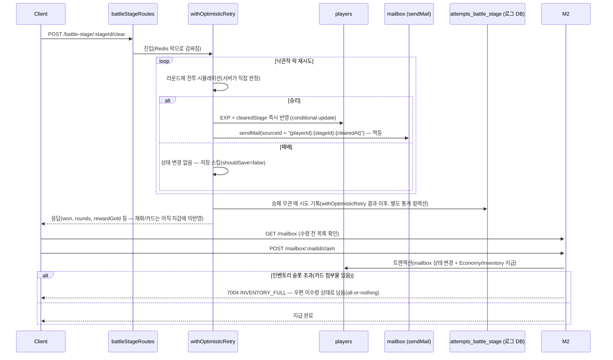

# 07_BATTLE_MAILBOX_SCENARIO.md

전투(Battle-Stage) 클리어부터 우편(Mailbox) 발송·수령까지 이어지는 흐름과 멱등성 설계.

## 왜 보상을 즉시 지급하지 않고 우편을 경유하는가

스테이지 클리어 보상 중 EXP/`clearedStage`는 Player 애그리게잇에 **즉시** 반영하지만,
골드/강화석/드랍 카드는 **우편으로 발송**한다 — Battle-Stage도 Redis 락 + 낙관적 락
재시도 구조(`withOptimisticRetry`, `06_ENHANCEMENT_SYNTHESIS_SCENARIO.md`와 동일 패턴)를
쓰는데, 재시도 도중 같은 보상을 여러 번 지급하면 안 된다. `sendMail()`이
`(sourceType, sourceId)` unique 인덱스로 이미 멱등 발송을 보장하므로, 재시도 전체에서
**같은 `sourceId`를 재사용**하면 몇 번 재시도해도 우편은 정확히 한 번만 만들어진다 —
이 멱등성을 재화/카드 지급에 그대로 활용한 것이다. EXP는 "우편으로 받는 경험치"가
게임 모델과 맞지 않아 예외로 즉시 지급한다.

## 흐름

- **`attempts_battle_stage`**(로그 DB, 승패 무관 매 시도)와 **`log_battle_stage`**(승리
  시에만)는 별개 목적이라 둘 다 남는다 — `08_AUDIT_LOG_POLICY.md` 참고.
- 패배는 상태 변경이 없어 `writeAuditLog`도 호출되지 않는다(`shouldSave` 기준과 동일).

## 인벤토리 슬롯 상한과의 상호작용

- **SendMail 시점**: 상한과 무관하게 무조건 발송 — 아직 인벤토리를 건드리지 않아 체크할
  대상이 없다.
- **ClaimMail 시점**: 카드 첨부물이 있을 때만 `현재 인벤토리 수 + 첨부 카드 수 >
  INVENTORY_SLOT_CAP`을 검증한다. 초과 시 골드/강화석 등 동봉 보상도 함께 거부한다
  (all-or-nothing) — 유저가 슬롯을 비운 뒤 재수령하면 되지만, 우편 만료(7일) 안에
  비우지 못하면 카드를 잃을 수 있는 유일한 보상 종류다.

## 만료 우편 정리 배치와는 별개

위 흐름과 별개로, `MAILBOX_CLEANUP_CRON`(기본 매월 1일 00시)이 수령 여부와 무관하게
만료 후 `MAILBOX_CLEANUP_RETENTION_MONTHS`(기본 3개월) 지난 우편을 물리 삭제한다.
`system_batch_runs` 멱등 마커로 인스턴스 중복 실행을 막는다(`04_DATA_MODEL.md` 참고).
