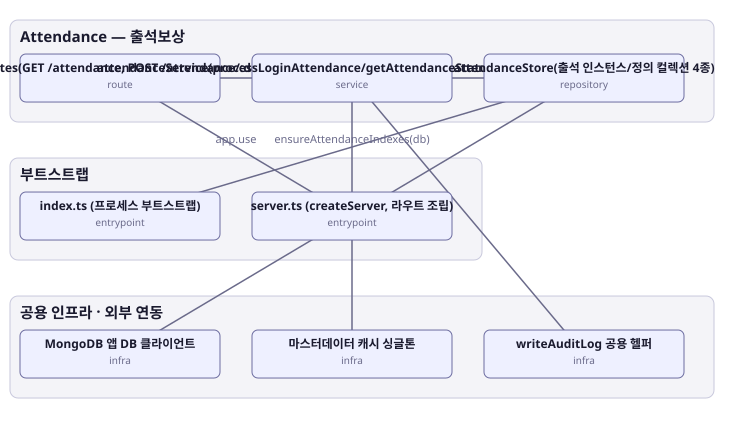

# 아키텍처 스냅샷 — enhance-or-bust-attendance

- 기준 커밋: `9c88667`
- 생성 시각: 2026-09-28T00:00:00Z
- 경계: Attendance — 출석보상, 부트스트랩, 공용 인프라 · 외부 연동
- 노드 8개, 엣지 7개

## 노드

| boundary | kind | label | evidence | 신뢰도 |
|---|---|---|---|---|
| 부트스트랩 | entrypoint | index.ts (프로세스 부트스트랩) | `src/index.ts:1-79` |  |
| 부트스트랩 | entrypoint | server.ts (createServer, 라우트 조립) | `src/server.ts:33-67` |  |
| 공용 인프라 · 외부 연동 | infra | MongoDB 앱 DB 클라이언트 | `src/infra/mongo.ts:14-56` |  |
| 공용 인프라 · 외부 연동 | infra | 마스터데이터 캐시 싱글톤 | `src/shared-kernel/masterData/masterDataCache.ts:36-295` |  |
| 공용 인프라 · 외부 연동 | infra | writeAuditLog 공용 헬퍼 | `src/shared-kernel/auditLog.ts:8-32` |  |
| Attendance — 출석보상 | route | attendanceRoutes(GET /attendance, POST /attendance/:defId/catchup) | `src/contexts/attendance/routes/attendanceRoutes.ts:21-40` |  |
| Attendance — 출석보상 | service | attendanceService(processLoginAttendance/getAttendanceStatus/purchaseCatchup) | `src/contexts/attendance/application/attendanceService.ts:263` |  |
| Attendance — 출석보상 | repository | attendanceStore(출석 인스턴스/정의 컬렉션 4종) | `src/contexts/attendance/infrastructure/attendanceStore.ts:16-50` |  |

## 엣지

| from | to | label |
|---|---|---|
| index.ts (프로세스 부트스트랩) | attendanceStore(출석 인스턴스/정의 컬렉션 4종) | ensureAttendanceIndexes(db) |
| server.ts (createServer, 라우트 조립) | attendanceRoutes(GET /attendance, POST /attendance/:defId/catchup) | app.use |
| attendanceRoutes(GET /attendance, POST /attendance/:defId/catchup) | attendanceService(processLoginAttendance/getAttendanceStatus/purchaseCatchup) |  |
| attendanceService(processLoginAttendance/getAttendanceStatus/purchaseCatchup) | attendanceStore(출석 인스턴스/정의 컬렉션 4종) |  |
| attendanceService(processLoginAttendance/getAttendanceStatus/purchaseCatchup) | 마스터데이터 캐시 싱글톤 | 출석부 정의/보상 조회 |
| attendanceService(processLoginAttendance/getAttendanceStatus/purchaseCatchup) | writeAuditLog 공용 헬퍼 |  |
| attendanceStore(출석 인스턴스/정의 컬렉션 4종) | MongoDB 앱 DB 클라이언트 |  |
