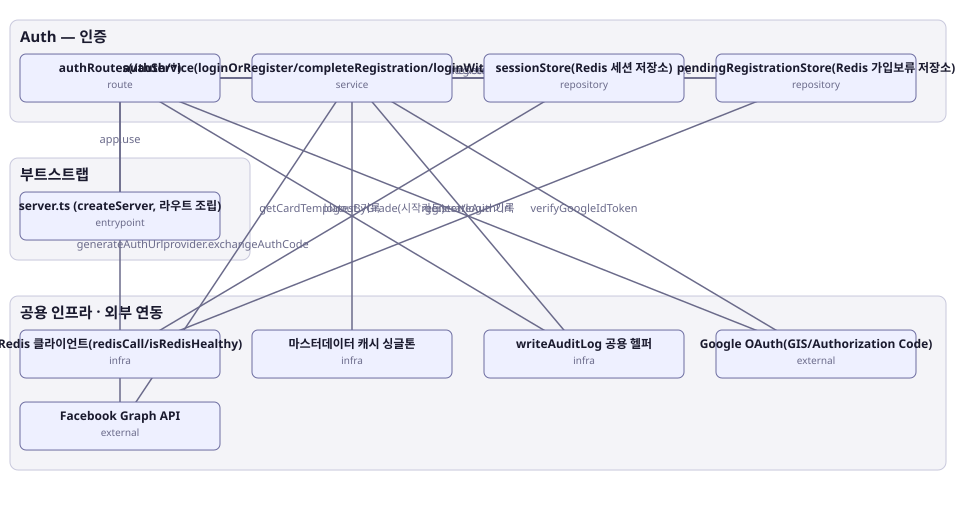

# 아키텍처 스냅샷 — enhance-or-bust-auth

- 기준 커밋: `9c88667`
- 생성 시각: 2026-09-28T00:00:00Z
- 경계: Auth — 인증, 부트스트랩, 공용 인프라 · 외부 연동
- 노드 10개, 엣지 15개

## 노드

| boundary | kind | label | evidence | 신뢰도 |
|---|---|---|---|---|
| 부트스트랩 | entrypoint | server.ts (createServer, 라우트 조립) | `src/server.ts:33-67` |  |
| 공용 인프라 · 외부 연동 | infra | Redis 클라이언트(redisCall/isRedisHealthy) | `src/infra/redis.ts:30-97` |  |
| 공용 인프라 · 외부 연동 | infra | 마스터데이터 캐시 싱글톤 | `src/shared-kernel/masterData/masterDataCache.ts:36-295` |  |
| 공용 인프라 · 외부 연동 | infra | writeAuditLog 공용 헬퍼 | `src/shared-kernel/auditLog.ts:8-32` |  |
| 공용 인프라 · 외부 연동 | external | Google OAuth(GIS/Authorization Code) | `src/contexts/auth/infrastructure/googleAuth.ts:26-76` |  |
| 공용 인프라 · 외부 연동 | external | Facebook Graph API | `src/contexts/auth/infrastructure/facebookAuth.ts:17-65` |  |
| Auth — 인증 | route | authRoutes(/auth/*) | `src/contexts/auth/routes/authRoutes.ts:50-194` |  |
| Auth — 인증 | service | authService(loginOrRegister/completeRegistration/loginWithSocialProvider) | `src/contexts/auth/application/authService.ts:1-172` |  |
| Auth — 인증 | repository | sessionStore(Redis 세션 저장소) | `src/contexts/auth/infrastructure/sessionStore.ts:18-52` |  |
| Auth — 인증 | repository | pendingRegistrationStore(Redis 가입보류 저장소) | `src/contexts/auth/infrastructure/pendingRegistrationStore.ts:29-55` |  |

## 엣지

| from | to | label |
|---|---|---|
| server.ts (createServer, 라우트 조립) | authRoutes(/auth/*) | app.use |
| authRoutes(/auth/*) | authService(loginOrRegister/completeRegistration/loginWithSocialProvider) |  |
| authRoutes(/auth/*) | sessionStore(Redis 세션 저장소) | logout: resolveSession/deleteSession |
| authRoutes(/auth/*) | pendingRegistrationStore(Redis 가입보류 저장소) | GET /auth/register/pending |
| authRoutes(/auth/*) | Google OAuth(GIS/Authorization Code) | generateAuthUrl |
| authRoutes(/auth/*) | Facebook Graph API | generateAuthUrl |
| authRoutes(/auth/*) | writeAuditLog 공용 헬퍼 | logout 기록 |
| authService(loginOrRegister/completeRegistration/loginWithSocialProvider) | sessionStore(Redis 세션 저장소) | createSession |
| authService(loginOrRegister/completeRegistration/loginWithSocialProvider) | pendingRegistrationStore(Redis 가입보류 저장소) | createPendingRegistration/resolve/delete |
| authService(loginOrRegister/completeRegistration/loginWithSocialProvider) | Google OAuth(GIS/Authorization Code) | verifyGoogleIdToken |
| authService(loginOrRegister/completeRegistration/loginWithSocialProvider) | Facebook Graph API | provider.exchangeAuthCode |
| authService(loginOrRegister/completeRegistration/loginWithSocialProvider) | 마스터데이터 캐시 싱글톤 | getCardTemplatesByGrade(시작카드) |
| authService(loginOrRegister/completeRegistration/loginWithSocialProvider) | writeAuditLog 공용 헬퍼 | register/login 기록 |
| sessionStore(Redis 세션 저장소) | Redis 클라이언트(redisCall/isRedisHealthy) |  |
| pendingRegistrationStore(Redis 가입보류 저장소) | Redis 클라이언트(redisCall/isRedisHealthy) |  |
