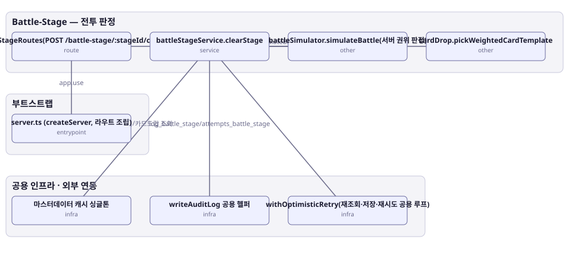

# 아키텍처 스냅샷 — enhance-or-bust-battleStage

- 기준 커밋: `9c88667`
- 생성 시각: 2026-09-28T00:00:00Z
- 경계: Battle-Stage — 전투 판정, 부트스트랩, 공용 인프라 · 외부 연동
- 노드 8개, 엣지 7개

## 노드

| boundary | kind | label | evidence | 신뢰도 |
|---|---|---|---|---|
| 부트스트랩 | entrypoint | server.ts (createServer, 라우트 조립) | `src/server.ts:33-67` |  |
| 공용 인프라 · 외부 연동 | infra | 마스터데이터 캐시 싱글톤 | `src/shared-kernel/masterData/masterDataCache.ts:36-295` |  |
| 공용 인프라 · 외부 연동 | infra | writeAuditLog 공용 헬퍼 | `src/shared-kernel/auditLog.ts:8-32` |  |
| 공용 인프라 · 외부 연동 | infra | withOptimisticRetry(재조회·저장·재시도 공용 루프) | `src/shared-kernel/optimisticPlayerWrite.ts:39-66` |  |
| Battle-Stage — 전투 판정 | route | battleStageRoutes(POST /battle-stage/:stageId/clear) | `src/contexts/battleStage/routes/battleStageRoutes.ts:20-35` |  |
| Battle-Stage — 전투 판정 | service | battleStageService.clearStage | `src/contexts/battleStage/application/battleStageService.ts:75-228` |  |
| Battle-Stage — 전투 판정 | other | battleSimulator.simulateBattle(서버 권위 판정) | `src/contexts/battleStage/domain/battleSimulator.ts:10-72` |  |
| Battle-Stage — 전투 판정 | other | cardDrop.pickWeightedCardTemplate | `src/contexts/battleStage/domain/cardDrop.ts:6-30` |  |

## 엣지

| from | to | label |
|---|---|---|
| server.ts (createServer, 라우트 조립) | battleStageRoutes(POST /battle-stage/:stageId/clear) | app.use |
| battleStageRoutes(POST /battle-stage/:stageId/clear) | battleStageService.clearStage |  |
| battleStageService.clearStage | withOptimisticRetry(재조회·저장·재시도 공용 루프) |  |
| battleStageService.clearStage | 마스터데이터 캐시 싱글톤 | 스테이지/카드드랍 조회 |
| battleStageService.clearStage | battleSimulator.simulateBattle(서버 권위 판정) | simulateBattle |
| battleStageService.clearStage | cardDrop.pickWeightedCardTemplate | pickWeightedCardTemplate |
| battleStageService.clearStage | writeAuditLog 공용 헬퍼 | log_battle_stage/attempts_battle_stage |
