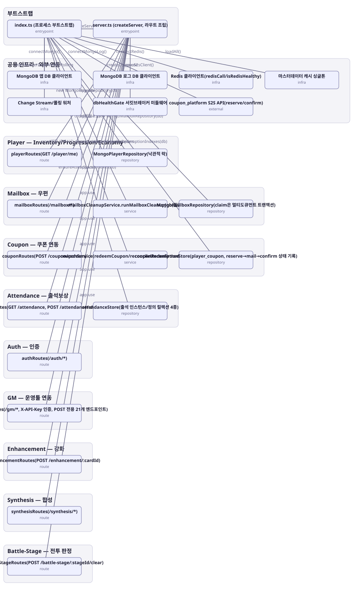

# 아키텍처 스냅샷 — enhance-or-bust-bootstrap

- 기준 커밋: `9c88667`
- 생성 시각: 2026-09-28T00:00:00Z
- 경계: 부트스트랩, 공용 인프라 · 외부 연동, Player — Inventory/Progression/Economy, Mailbox — 우편, Coupon — 쿠폰 연동, Attendance — 출석보상, Auth — 인증, GM — 운영툴 연동, Enhancement — 강화, Synthesis — 합성, Battle-Stage — 전투 판정
- 노드 24개, 엣지 23개

## 노드

| boundary | kind | label | evidence | 신뢰도 |
|---|---|---|---|---|
| 부트스트랩 | entrypoint | index.ts (프로세스 부트스트랩) | `src/index.ts:1-79` |  |
| 부트스트랩 | entrypoint | server.ts (createServer, 라우트 조립) | `src/server.ts:33-67` |  |
| 공용 인프라 · 외부 연동 | infra | MongoDB 앱 DB 클라이언트 | `src/infra/mongo.ts:14-56` |  |
| 공용 인프라 · 외부 연동 | infra | MongoDB 로그 DB 클라이언트 | `src/infra/mongoLog.ts:15-41` |  |
| 공용 인프라 · 외부 연동 | infra | Redis 클라이언트(redisCall/isRedisHealthy) | `src/infra/redis.ts:30-97` |  |
| 공용 인프라 · 외부 연동 | infra | 마스터데이터 캐시 싱글톤 | `src/shared-kernel/masterData/masterDataCache.ts:36-295` |  |
| 공용 인프라 · 외부 연동 | infra | Change Stream/폴링 워처 | `src/shared-kernel/masterData/masterDataWatcher.ts:36-116` |  |
| 공용 인프라 · 외부 연동 | infra | dbHealthGate 서킷브레이커 미들웨어 | `src/shared-kernel/dbHealthGate.ts:21` |  |
| 공용 인프라 · 외부 연동 | external | coupon_platform S2S API(reserve/confirm) | `src/contexts/coupon/infrastructure/couponS2sClient.ts:1-43` |  |
| Auth — 인증 | route | authRoutes(/auth/*) | `src/contexts/auth/routes/authRoutes.ts:50-194` |  |
| Player — Inventory/Progression/Economy | route | playerRoutes(GET /player/me) | `src/contexts/player/routes/playerRoutes.ts:20-30` |  |
| Player — Inventory/Progression/Economy | repository | MongoPlayerRepository(낙관적 락) | `src/contexts/player/infrastructure/mongoPlayerRepository.ts:73` |  |
| Enhancement — 강화 | route | enhancementRoutes(POST /enhancement/:cardId) | `src/contexts/enhancement/routes/enhancementRoutes.ts:13-23` |  |
| Synthesis — 합성 | route | synthesisRoutes(/synthesis/*) | `src/contexts/synthesis/routes/synthesisRoutes.ts:16-39` |  |
| Battle-Stage — 전투 판정 | route | battleStageRoutes(POST /battle-stage/:stageId/clear) | `src/contexts/battleStage/routes/battleStageRoutes.ts:20-35` |  |
| Mailbox — 우편 | route | mailboxRoutes(/mailbox/*) | `src/contexts/mailbox/routes/mailboxRoutes.ts:16-36` |  |
| Mailbox — 우편 | service | mailboxCleanupService.runMailboxCleanupJob(월간 배치) | `src/contexts/mailbox/application/mailboxCleanupService.ts:23-44` |  |
| Mailbox — 우편 | repository | MongoMailboxRepository(claim은 멀티도큐먼트 트랜잭션) | `src/contexts/mailbox/infrastructure/mongoMailboxRepository.ts:35-40` |  |
| Coupon — 쿠폰 연동 | route | couponRoutes(POST /coupon/redeem) | `src/contexts/coupon/routes/couponRoutes.ts:31-44` |  |
| Coupon — 쿠폰 연동 | service | couponService(redeemCoupon/reconcileUnconfirmedCoupons) | `src/contexts/coupon/application/couponService.ts:104-195` |  |
| Coupon — 쿠폰 연동 | repository | couponRedemptionStore(player_coupon, reserve→mail→confirm 상태 기록) | `src/contexts/coupon/infrastructure/couponRedemptionStore.ts:11-28` |  |
| Attendance — 출석보상 | route | attendanceRoutes(GET /attendance, POST /attendance/:defId/catchup) | `src/contexts/attendance/routes/attendanceRoutes.ts:21-40` |  |
| Attendance — 출석보상 | repository | attendanceStore(출석 인스턴스/정의 컬렉션 4종) | `src/contexts/attendance/infrastructure/attendanceStore.ts:16-50` |  |
| GM — 운영툴 연동 | route | gmRoutes(/gm/*, X-API-Key 인증, POST 전용 21개 엔드포인트) | `src/contexts/gm/routes/gmRoutes.ts:191-306` |  |

## 엣지

| from | to | label |
|---|---|---|
| index.ts (프로세스 부트스트랩) | MongoDB 앱 DB 클라이언트 | connectMongo() |
| index.ts (프로세스 부트스트랩) | MongoDB 로그 DB 클라이언트 | connectMongoLog() |
| index.ts (프로세스 부트스트랩) | Redis 클라이언트(redisCall/isRedisHealthy) | connectRedis() |
| index.ts (프로세스 부트스트랩) | 마스터데이터 캐시 싱글톤 | loadAll() |
| index.ts (프로세스 부트스트랩) | Change Stream/폴링 워처 | startMasterDataWatch/Polling |
| index.ts (프로세스 부트스트랩) | MongoPlayerRepository(낙관적 락) | new MongoPlayerRepository(db) |
| index.ts (프로세스 부트스트랩) | MongoMailboxRepository(claim은 멀티도큐먼트 트랜잭션) | new MongoMailboxRepository(db) |
| index.ts (프로세스 부트스트랩) | couponRedemptionStore(player_coupon, reserve→mail→confirm 상태 기록) | ensureCouponRedemptionIndexes(db) |
| index.ts (프로세스 부트스트랩) | attendanceStore(출석 인스턴스/정의 컬렉션 4종) | ensureAttendanceIndexes(db) |
| index.ts (프로세스 부트스트랩) | server.ts (createServer, 라우트 조립) | createServer(...) |
| index.ts (프로세스 부트스트랩) | mailboxCleanupService.runMailboxCleanupJob(월간 배치) | cron(매월 1일) |
| index.ts (프로세스 부트스트랩) | couponService(redeemCoupon/reconcileUnconfirmedCoupons) | cron(매일 새벽4시) reconcileUnconfirmedCoupons |
| index.ts (프로세스 부트스트랩) | coupon_platform S2S API(reserve/confirm) | createCouponS2sClient() |
| server.ts (createServer, 라우트 조립) | dbHealthGate 서킷브레이커 미들웨어 | app.use |
| server.ts (createServer, 라우트 조립) | authRoutes(/auth/*) | app.use |
| server.ts (createServer, 라우트 조립) | gmRoutes(/gm/*, X-API-Key 인증, POST 전용 21개 엔드포인트) | app.use |
| server.ts (createServer, 라우트 조립) | enhancementRoutes(POST /enhancement/:cardId) | app.use |
| server.ts (createServer, 라우트 조립) | synthesisRoutes(/synthesis/*) | app.use |
| server.ts (createServer, 라우트 조립) | battleStageRoutes(POST /battle-stage/:stageId/clear) | app.use |
| server.ts (createServer, 라우트 조립) | mailboxRoutes(/mailbox/*) | app.use |
| server.ts (createServer, 라우트 조립) | couponRoutes(POST /coupon/redeem) | app.use |
| server.ts (createServer, 라우트 조립) | playerRoutes(GET /player/me) | app.use |
| server.ts (createServer, 라우트 조립) | attendanceRoutes(GET /attendance, POST /attendance/:defId/catchup) | app.use |
