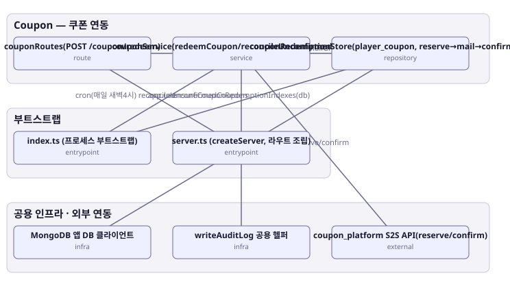

# 아키텍처 스냅샷 — enhance-or-bust-coupon

- 기준 커밋: `9c88667`
- 생성 시각: 2026-09-28T00:00:00Z
- 경계: Coupon — 쿠폰 연동, 부트스트랩, 공용 인프라 · 외부 연동
- 노드 8개, 엣지 8개

## 노드

| boundary | kind | label | evidence | 신뢰도 |
|---|---|---|---|---|
| 부트스트랩 | entrypoint | index.ts (프로세스 부트스트랩) | `src/index.ts:1-79` |  |
| 부트스트랩 | entrypoint | server.ts (createServer, 라우트 조립) | `src/server.ts:33-67` |  |
| 공용 인프라 · 외부 연동 | infra | MongoDB 앱 DB 클라이언트 | `src/infra/mongo.ts:14-56` |  |
| 공용 인프라 · 외부 연동 | infra | writeAuditLog 공용 헬퍼 | `src/shared-kernel/auditLog.ts:8-32` |  |
| 공용 인프라 · 외부 연동 | external | coupon_platform S2S API(reserve/confirm) | `src/contexts/coupon/infrastructure/couponS2sClient.ts:1-43` |  |
| Coupon — 쿠폰 연동 | route | couponRoutes(POST /coupon/redeem) | `src/contexts/coupon/routes/couponRoutes.ts:31-44` |  |
| Coupon — 쿠폰 연동 | service | couponService(redeemCoupon/reconcileUnconfirmedCoupons) | `src/contexts/coupon/application/couponService.ts:104-195` |  |
| Coupon — 쿠폰 연동 | repository | couponRedemptionStore(player_coupon, reserve→mail→confirm 상태 기록) | `src/contexts/coupon/infrastructure/couponRedemptionStore.ts:11-28` |  |

## 엣지

| from | to | label |
|---|---|---|
| index.ts (프로세스 부트스트랩) | couponRedemptionStore(player_coupon, reserve→mail→confirm 상태 기록) | ensureCouponRedemptionIndexes(db) |
| index.ts (프로세스 부트스트랩) | couponService(redeemCoupon/reconcileUnconfirmedCoupons) | cron(매일 새벽4시) reconcileUnconfirmedCoupons |
| server.ts (createServer, 라우트 조립) | couponRoutes(POST /coupon/redeem) | app.use |
| couponRoutes(POST /coupon/redeem) | couponService(redeemCoupon/reconcileUnconfirmedCoupons) |  |
| couponService(redeemCoupon/reconcileUnconfirmedCoupons) | coupon_platform S2S API(reserve/confirm) | reserve/confirm |
| couponService(redeemCoupon/reconcileUnconfirmedCoupons) | couponRedemptionStore(player_coupon, reserve→mail→confirm 상태 기록) | recordReserved/markMailGranted/markConfirmed |
| couponService(redeemCoupon/reconcileUnconfirmedCoupons) | writeAuditLog 공용 헬퍼 |  |
| couponRedemptionStore(player_coupon, reserve→mail→confirm 상태 기록) | MongoDB 앱 DB 클라이언트 |  |
