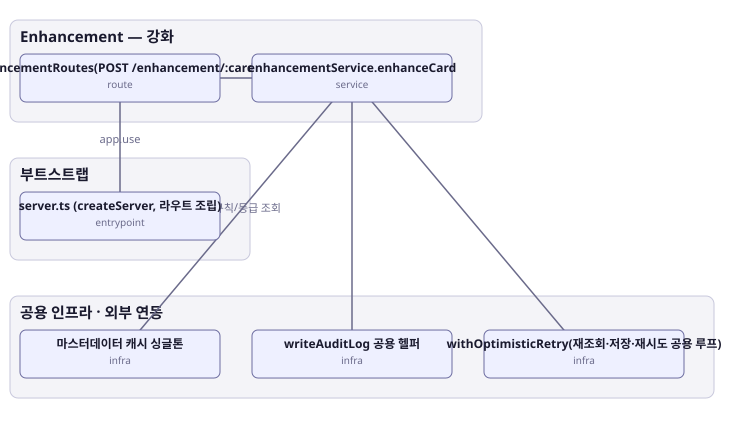

# 아키텍처 스냅샷 — enhance-or-bust-enhancement

- 기준 커밋: `9c88667`
- 생성 시각: 2026-09-28T00:00:00Z
- 경계: Enhancement — 강화, 부트스트랩, 공용 인프라 · 외부 연동
- 노드 6개, 엣지 5개

## 노드

| boundary | kind | label | evidence | 신뢰도 |
|---|---|---|---|---|
| 부트스트랩 | entrypoint | server.ts (createServer, 라우트 조립) | `src/server.ts:33-67` |  |
| 공용 인프라 · 외부 연동 | infra | 마스터데이터 캐시 싱글톤 | `src/shared-kernel/masterData/masterDataCache.ts:36-295` |  |
| 공용 인프라 · 외부 연동 | infra | writeAuditLog 공용 헬퍼 | `src/shared-kernel/auditLog.ts:8-32` |  |
| 공용 인프라 · 외부 연동 | infra | withOptimisticRetry(재조회·저장·재시도 공용 루프) | `src/shared-kernel/optimisticPlayerWrite.ts:39-66` |  |
| Enhancement — 강화 | route | enhancementRoutes(POST /enhancement/:cardId) | `src/contexts/enhancement/routes/enhancementRoutes.ts:13-23` |  |
| Enhancement — 강화 | service | enhancementService.enhanceCard | `src/contexts/enhancement/application/enhancementService.ts:39-97` |  |

## 엣지

| from | to | label |
|---|---|---|
| server.ts (createServer, 라우트 조립) | enhancementRoutes(POST /enhancement/:cardId) | app.use |
| enhancementRoutes(POST /enhancement/:cardId) | enhancementService.enhanceCard |  |
| enhancementService.enhanceCard | withOptimisticRetry(재조회·저장·재시도 공용 루프) |  |
| enhancementService.enhanceCard | 마스터데이터 캐시 싱글톤 | 강화 규칙/등급 조회 |
| enhancementService.enhanceCard | writeAuditLog 공용 헬퍼 |  |
