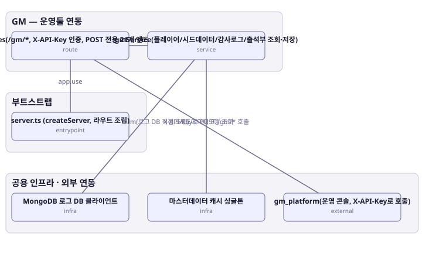

# 아키텍처 스냅샷 — enhance-or-bust-gm

- 기준 커밋: `9c88667`
- 생성 시각: 2026-09-28T00:00:00Z
- 경계: GM — 운영툴 연동, 부트스트랩, 공용 인프라 · 외부 연동
- 노드 6개, 엣지 5개

## 노드

| boundary | kind | label | evidence | 신뢰도 |
|---|---|---|---|---|
| 부트스트랩 | entrypoint | server.ts (createServer, 라우트 조립) | `src/server.ts:33-67` |  |
| 공용 인프라 · 외부 연동 | infra | MongoDB 로그 DB 클라이언트 | `src/infra/mongoLog.ts:15-41` |  |
| 공용 인프라 · 외부 연동 | infra | 마스터데이터 캐시 싱글톤 | `src/shared-kernel/masterData/masterDataCache.ts:36-295` |  |
| 공용 인프라 · 외부 연동 | external | gm_platform(운영 콘솔, X-API-Key로 호출) | `src/contexts/gm/routes/gmRoutes.ts:172-190` |  |
| GM — 운영툴 연동 | route | gmRoutes(/gm/*, X-API-Key 인증, POST 전용 21개 엔드포인트) | `src/contexts/gm/routes/gmRoutes.ts:191-306` |  |
| GM — 운영툴 연동 | service | gmService(플레이어/시드데이터/감사로그/출석부 조회·저장) | `src/contexts/gm/application/gmService.ts:74-554` |  |

## 엣지

| from | to | label |
|---|---|---|
| server.ts (createServer, 라우트 조립) | gmRoutes(/gm/*, X-API-Key 인증, POST 전용 21개 엔드포인트) | app.use |
| gmRoutes(/gm/*, X-API-Key 인증, POST 전용 21개 엔드포인트) | gmService(플레이어/시드데이터/감사로그/출석부 조회·저장) |  |
| gmService(플레이어/시드데이터/감사로그/출석부 조회·저장) | 마스터데이터 캐시 싱글톤 | 시드데이터 9종 조회 |
| gmService(플레이어/시드데이터/감사로그/출석부 조회·저장) | MongoDB 로그 DB 클라이언트 | get*LogsForGm(로그 DB 직접 조회) |
| gm_platform(운영 콘솔, X-API-Key로 호출) | gmRoutes(/gm/*, X-API-Key 인증, POST 전용 21개 엔드포인트) | X-API-Key로 POST /gm/* 호출 |
