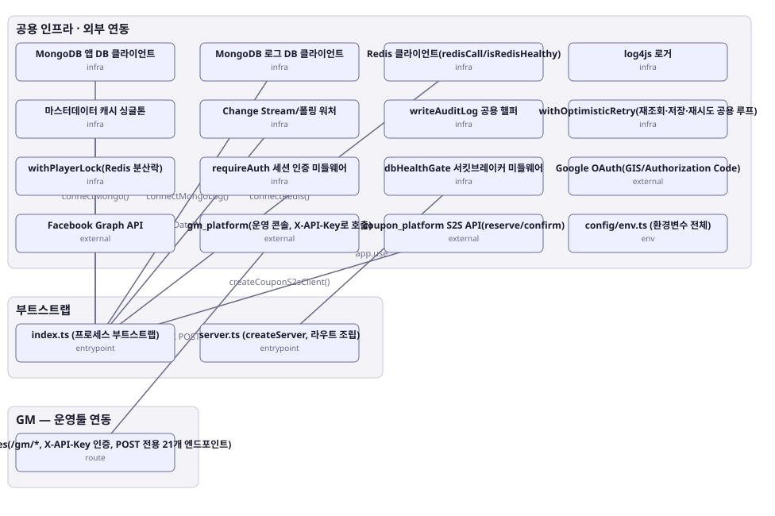

# 아키텍처 스냅샷 — enhance-or-bust-infra

- 기준 커밋: `9c88667`
- 생성 시각: 2026-09-28T00:00:00Z
- 경계: 공용 인프라 · 외부 연동, 부트스트랩, GM — 운영툴 연동
- 노드 19개, 엣지 8개

## 노드

| boundary | kind | label | evidence | 신뢰도 |
|---|---|---|---|---|
| 부트스트랩 | entrypoint | index.ts (프로세스 부트스트랩) | `src/index.ts:1-79` |  |
| 부트스트랩 | entrypoint | server.ts (createServer, 라우트 조립) | `src/server.ts:33-67` |  |
| 공용 인프라 · 외부 연동 | infra | MongoDB 앱 DB 클라이언트 | `src/infra/mongo.ts:14-56` |  |
| 공용 인프라 · 외부 연동 | infra | MongoDB 로그 DB 클라이언트 | `src/infra/mongoLog.ts:15-41` |  |
| 공용 인프라 · 외부 연동 | infra | Redis 클라이언트(redisCall/isRedisHealthy) | `src/infra/redis.ts:30-97` |  |
| 공용 인프라 · 외부 연동 | infra | log4js 로거 | `src/infra/logger.ts:71` |  |
| 공용 인프라 · 외부 연동 | infra | 마스터데이터 캐시 싱글톤 | `src/shared-kernel/masterData/masterDataCache.ts:36-295` |  |
| 공용 인프라 · 외부 연동 | infra | Change Stream/폴링 워처 | `src/shared-kernel/masterData/masterDataWatcher.ts:36-116` |  |
| 공용 인프라 · 외부 연동 | infra | writeAuditLog 공용 헬퍼 | `src/shared-kernel/auditLog.ts:8-32` |  |
| 공용 인프라 · 외부 연동 | infra | withOptimisticRetry(재조회·저장·재시도 공용 루프) | `src/shared-kernel/optimisticPlayerWrite.ts:39-66` |  |
| 공용 인프라 · 외부 연동 | infra | withPlayerLock(Redis 분산락) | `src/shared-kernel/redisLock.ts:46` |  |
| 공용 인프라 · 외부 연동 | infra | requireAuth 세션 인증 미들웨어 | `src/shared-kernel/sessionAuth.ts:18` |  |
| 공용 인프라 · 외부 연동 | infra | dbHealthGate 서킷브레이커 미들웨어 | `src/shared-kernel/dbHealthGate.ts:21` |  |
| 공용 인프라 · 외부 연동 | env | config/env.ts (환경변수 전체) | `src/config/env.ts:7-53` |  |
| 공용 인프라 · 외부 연동 | external | Google OAuth(GIS/Authorization Code) | `src/contexts/auth/infrastructure/googleAuth.ts:26-76` |  |
| 공용 인프라 · 외부 연동 | external | Facebook Graph API | `src/contexts/auth/infrastructure/facebookAuth.ts:17-65` |  |
| 공용 인프라 · 외부 연동 | external | gm_platform(운영 콘솔, X-API-Key로 호출) | `src/contexts/gm/routes/gmRoutes.ts:172-190` |  |
| 공용 인프라 · 외부 연동 | external | coupon_platform S2S API(reserve/confirm) | `src/contexts/coupon/infrastructure/couponS2sClient.ts:1-43` |  |
| GM — 운영툴 연동 | route | gmRoutes(/gm/*, X-API-Key 인증, POST 전용 21개 엔드포인트) | `src/contexts/gm/routes/gmRoutes.ts:191-306` |  |

## 엣지

| from | to | label |
|---|---|---|
| index.ts (프로세스 부트스트랩) | MongoDB 앱 DB 클라이언트 | connectMongo() |
| index.ts (프로세스 부트스트랩) | MongoDB 로그 DB 클라이언트 | connectMongoLog() |
| index.ts (프로세스 부트스트랩) | Redis 클라이언트(redisCall/isRedisHealthy) | connectRedis() |
| index.ts (프로세스 부트스트랩) | 마스터데이터 캐시 싱글톤 | loadAll() |
| index.ts (프로세스 부트스트랩) | Change Stream/폴링 워처 | startMasterDataWatch/Polling |
| index.ts (프로세스 부트스트랩) | coupon_platform S2S API(reserve/confirm) | createCouponS2sClient() |
| server.ts (createServer, 라우트 조립) | dbHealthGate 서킷브레이커 미들웨어 | app.use |
| gm_platform(운영 콘솔, X-API-Key로 호출) | gmRoutes(/gm/*, X-API-Key 인증, POST 전용 21개 엔드포인트) | X-API-Key로 POST /gm/* 호출 |
