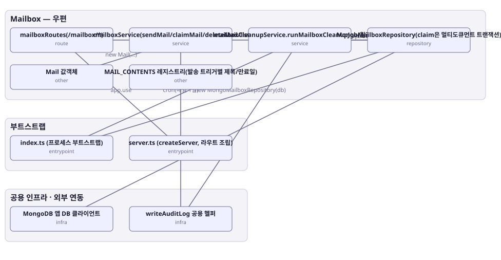

# 아키텍처 스냅샷 — enhance-or-bust-mailbox

- 기준 커밋: `9c88667`
- 생성 시각: 2026-09-28T00:00:00Z
- 경계: Mailbox — 우편, 부트스트랩, 공용 인프라 · 외부 연동
- 노드 10개, 엣지 10개

## 노드

| boundary | kind | label | evidence | 신뢰도 |
|---|---|---|---|---|
| 부트스트랩 | entrypoint | index.ts (프로세스 부트스트랩) | `src/index.ts:1-79` |  |
| 부트스트랩 | entrypoint | server.ts (createServer, 라우트 조립) | `src/server.ts:33-67` |  |
| 공용 인프라 · 외부 연동 | infra | MongoDB 앱 DB 클라이언트 | `src/infra/mongo.ts:14-56` |  |
| 공용 인프라 · 외부 연동 | infra | writeAuditLog 공용 헬퍼 | `src/shared-kernel/auditLog.ts:8-32` |  |
| Mailbox — 우편 | route | mailboxRoutes(/mailbox/*) | `src/contexts/mailbox/routes/mailboxRoutes.ts:16-36` |  |
| Mailbox — 우편 | service | mailboxService(sendMail/claimMail/deleteMail/listMails) | `src/contexts/mailbox/application/mailboxService.ts:31-100` |  |
| Mailbox — 우편 | service | mailboxCleanupService.runMailboxCleanupJob(월간 배치) | `src/contexts/mailbox/application/mailboxCleanupService.ts:23-44` |  |
| Mailbox — 우편 | repository | MongoMailboxRepository(claim은 멀티도큐먼트 트랜잭션) | `src/contexts/mailbox/infrastructure/mongoMailboxRepository.ts:35-40` |  |
| Mailbox — 우편 | other | Mail 값객체 | `src/contexts/mailbox/domain/mail.ts:8-31` |  |
| Mailbox — 우편 | other | MAIL_CONTENTS 레지스트리(발송 트리거별 제목/만료일) | `src/contexts/mailbox/domain/mailContent.ts:8-24` |  |

## 엣지

| from | to | label |
|---|---|---|
| index.ts (프로세스 부트스트랩) | MongoMailboxRepository(claim은 멀티도큐먼트 트랜잭션) | new MongoMailboxRepository(db) |
| index.ts (프로세스 부트스트랩) | mailboxCleanupService.runMailboxCleanupJob(월간 배치) | cron(매월 1일) |
| server.ts (createServer, 라우트 조립) | mailboxRoutes(/mailbox/*) | app.use |
| mailboxRoutes(/mailbox/*) | mailboxService(sendMail/claimMail/deleteMail/listMails) |  |
| mailboxService(sendMail/claimMail/deleteMail/listMails) | MongoMailboxRepository(claim은 멀티도큐먼트 트랜잭션) |  |
| mailboxService(sendMail/claimMail/deleteMail/listMails) | writeAuditLog 공용 헬퍼 |  |
| mailboxService(sendMail/claimMail/deleteMail/listMails) | Mail 값객체 | new Mail(...) |
| mailboxCleanupService.runMailboxCleanupJob(월간 배치) | MongoMailboxRepository(claim은 멀티도큐먼트 트랜잭션) | deleteExpiredBefore |
| mailboxCleanupService.runMailboxCleanupJob(월간 배치) | writeAuditLog 공용 헬퍼 |  |
| MongoMailboxRepository(claim은 멀티도큐먼트 트랜잭션) | MongoDB 앱 DB 클라이언트 |  |
