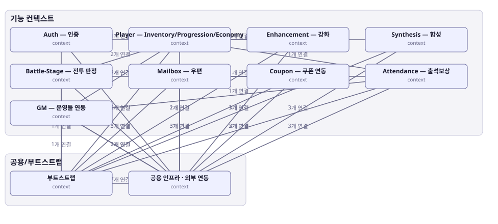

# 아키텍처 스냅샷 — enhance-or-bust-overview

- 기준 커밋: `9c88667`
- 생성 시각: 2026-09-28T00:00:00Z
- 경계: 기능 컨텍스트, 공용/부트스트랩
- 노드 11개, 엣지 30개

## 노드

| boundary | kind | label | evidence | 신뢰도 |
|---|---|---|---|---|
| 공용/부트스트랩 | context | 부트스트랩 | `docs/architecture/enhance-or-bust.json` |  |
| 공용/부트스트랩 | context | 공용 인프라 · 외부 연동 | `docs/architecture/enhance-or-bust.json` |  |
| 기능 컨텍스트 | context | Auth — 인증 | `docs/architecture/enhance-or-bust.json` |  |
| 기능 컨텍스트 | context | Player — Inventory/Progression/Economy | `docs/architecture/enhance-or-bust.json` |  |
| 기능 컨텍스트 | context | Enhancement — 강화 | `docs/architecture/enhance-or-bust.json` |  |
| 기능 컨텍스트 | context | Synthesis — 합성 | `docs/architecture/enhance-or-bust.json` |  |
| 기능 컨텍스트 | context | Battle-Stage — 전투 판정 | `docs/architecture/enhance-or-bust.json` |  |
| 기능 컨텍스트 | context | Mailbox — 우편 | `docs/architecture/enhance-or-bust.json` |  |
| 기능 컨텍스트 | context | Coupon — 쿠폰 연동 | `docs/architecture/enhance-or-bust.json` |  |
| 기능 컨텍스트 | context | Attendance — 출석보상 | `docs/architecture/enhance-or-bust.json` |  |
| 기능 컨텍스트 | context | GM — 운영툴 연동 | `docs/architecture/enhance-or-bust.json` |  |

## 엣지

| from | to | label |
|---|---|---|
| 부트스트랩 | 공용 인프라 · 외부 연동 | 7개 연결 |
| 부트스트랩 | Player — Inventory/Progression/Economy | 2개 연결 |
| 부트스트랩 | Mailbox — 우편 | 3개 연결 |
| 부트스트랩 | Coupon — 쿠폰 연동 | 3개 연결 |
| 부트스트랩 | Attendance — 출석보상 | 2개 연결 |
| 부트스트랩 | Auth — 인증 | 1개 연결 |
| 부트스트랩 | GM — 운영툴 연동 | 1개 연결 |
| 부트스트랩 | Enhancement — 강화 | 1개 연결 |
| 부트스트랩 | Synthesis — 합성 | 1개 연결 |
| 부트스트랩 | Battle-Stage — 전투 판정 | 1개 연결 |
| Auth — 인증 | 공용 인프라 · 외부 연동 | 9개 연결 |
| Auth — 인증 | Player — Inventory/Progression/Economy | 1개 연결 |
| Player — Inventory/Progression/Economy | 공용 인프라 · 외부 연동 | 2개 연결 |
| Player — Inventory/Progression/Economy | Attendance — 출석보상 | 1개 연결 |
| Enhancement — 강화 | 공용 인프라 · 외부 연동 | 3개 연결 |
| Enhancement — 강화 | Player — Inventory/Progression/Economy | 2개 연결 |
| Synthesis — 합성 | 공용 인프라 · 외부 연동 | 3개 연결 |
| Synthesis — 합성 | Player — Inventory/Progression/Economy | 2개 연결 |
| Battle-Stage — 전투 판정 | 공용 인프라 · 외부 연동 | 3개 연결 |
| Battle-Stage — 전투 판정 | Mailbox — 우편 | 2개 연결 |
| Battle-Stage — 전투 판정 | Player — Inventory/Progression/Economy | 2개 연결 |
| Mailbox — 우편 | 공용 인프라 · 외부 연동 | 3개 연결 |
| Coupon — 쿠폰 연동 | 공용 인프라 · 외부 연동 | 3개 연결 |
| Coupon — 쿠폰 연동 | Mailbox — 우편 | 1개 연결 |
| Attendance — 출석보상 | Mailbox — 우편 | 1개 연결 |
| Attendance — 출석보상 | 공용 인프라 · 외부 연동 | 3개 연결 |
| GM — 운영툴 연동 | Player — Inventory/Progression/Economy | 1개 연결 |
| GM — 운영툴 연동 | 공용 인프라 · 외부 연동 | 2개 연결 |
| GM — 운영툴 연동 | Attendance — 출석보상 | 1개 연결 |
| 공용 인프라 · 외부 연동 | GM — 운영툴 연동 | 1개 연결 |
