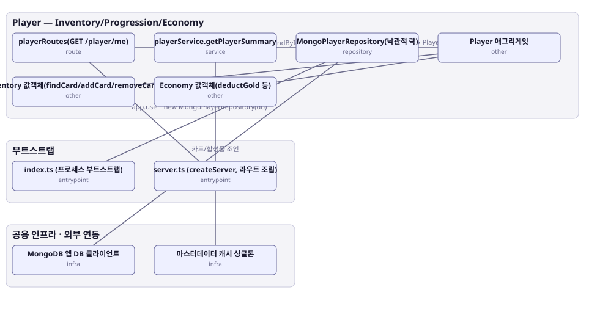

# 아키텍처 스냅샷 — enhance-or-bust-player

- 기준 커밋: `9c88667`
- 생성 시각: 2026-09-28T00:00:00Z
- 경계: Player — Inventory/Progression/Economy, 부트스트랩, 공용 인프라 · 외부 연동
- 노드 10개, 엣지 9개

## 노드

| boundary | kind | label | evidence | 신뢰도 |
|---|---|---|---|---|
| 부트스트랩 | entrypoint | index.ts (프로세스 부트스트랩) | `src/index.ts:1-79` |  |
| 부트스트랩 | entrypoint | server.ts (createServer, 라우트 조립) | `src/server.ts:33-67` |  |
| 공용 인프라 · 외부 연동 | infra | MongoDB 앱 DB 클라이언트 | `src/infra/mongo.ts:14-56` |  |
| 공용 인프라 · 외부 연동 | infra | 마스터데이터 캐시 싱글톤 | `src/shared-kernel/masterData/masterDataCache.ts:36-295` |  |
| Player — Inventory/Progression/Economy | route | playerRoutes(GET /player/me) | `src/contexts/player/routes/playerRoutes.ts:20-30` |  |
| Player — Inventory/Progression/Economy | service | playerService.getPlayerSummary | `src/contexts/player/application/playerService.ts:82` |  |
| Player — Inventory/Progression/Economy | repository | MongoPlayerRepository(낙관적 락) | `src/contexts/player/infrastructure/mongoPlayerRepository.ts:73` |  |
| Player — Inventory/Progression/Economy | other | Player 애그리게잇 | `src/contexts/player/domain/player.ts:12` |  |
| Player — Inventory/Progression/Economy | other | Inventory 값객체(findCard/addCard/removeCard) | `src/contexts/player/domain/inventory.ts:11` |  |
| Player — Inventory/Progression/Economy | other | Economy 값객체(deductGold 등) | `src/contexts/player/domain/economy.ts:9` |  |

## 엣지

| from | to | label |
|---|---|---|
| index.ts (프로세스 부트스트랩) | MongoPlayerRepository(낙관적 락) | new MongoPlayerRepository(db) |
| server.ts (createServer, 라우트 조립) | playerRoutes(GET /player/me) | app.use |
| playerRoutes(GET /player/me) | playerService.getPlayerSummary |  |
| playerService.getPlayerSummary | MongoPlayerRepository(낙관적 락) | findById |
| playerService.getPlayerSummary | 마스터데이터 캐시 싱글톤 | 카드/합성룰 조인 |
| MongoPlayerRepository(낙관적 락) | MongoDB 앱 DB 클라이언트 |  |
| MongoPlayerRepository(낙관적 락) | Player 애그리게잇 | 문서 ↔ Player 매핑 |
| Player 애그리게잇 | Inventory 값객체(findCard/addCard/removeCard) |  |
| Player 애그리게잇 | Economy 값객체(deductGold 등) |  |
