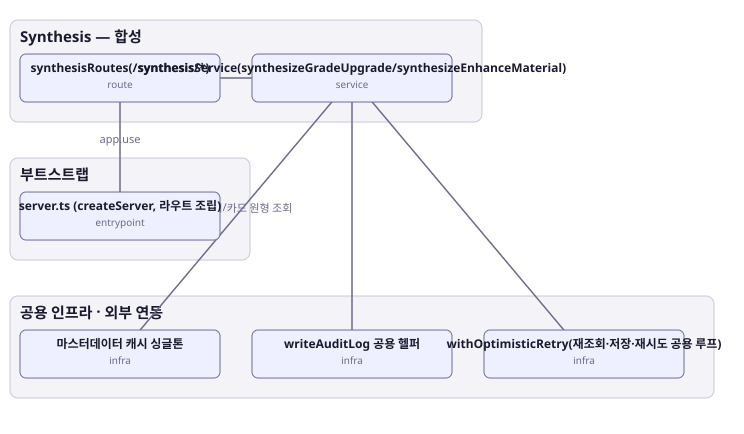

# 아키텍처 스냅샷 — enhance-or-bust-synthesis

- 기준 커밋: `9c88667`
- 생성 시각: 2026-09-28T00:00:00Z
- 경계: Synthesis — 합성, 부트스트랩, 공용 인프라 · 외부 연동
- 노드 6개, 엣지 5개

## 노드

| boundary | kind | label | evidence | 신뢰도 |
|---|---|---|---|---|
| 부트스트랩 | entrypoint | server.ts (createServer, 라우트 조립) | `src/server.ts:33-67` |  |
| 공용 인프라 · 외부 연동 | infra | 마스터데이터 캐시 싱글톤 | `src/shared-kernel/masterData/masterDataCache.ts:36-295` |  |
| 공용 인프라 · 외부 연동 | infra | writeAuditLog 공용 헬퍼 | `src/shared-kernel/auditLog.ts:8-32` |  |
| 공용 인프라 · 외부 연동 | infra | withOptimisticRetry(재조회·저장·재시도 공용 루프) | `src/shared-kernel/optimisticPlayerWrite.ts:39-66` |  |
| Synthesis — 합성 | route | synthesisRoutes(/synthesis/*) | `src/contexts/synthesis/routes/synthesisRoutes.ts:16-39` |  |
| Synthesis — 합성 | service | synthesisService(synthesizeGradeUpgrade/synthesizeEnhanceMaterial) | `src/contexts/synthesis/application/synthesisService.ts:43-168` |  |

## 엣지

| from | to | label |
|---|---|---|
| server.ts (createServer, 라우트 조립) | synthesisRoutes(/synthesis/*) | app.use |
| synthesisRoutes(/synthesis/*) | synthesisService(synthesizeGradeUpgrade/synthesizeEnhanceMaterial) |  |
| synthesisService(synthesizeGradeUpgrade/synthesizeEnhanceMaterial) | withOptimisticRetry(재조회·저장·재시도 공용 루프) |  |
| synthesisService(synthesizeGradeUpgrade/synthesizeEnhanceMaterial) | 마스터데이터 캐시 싱글톤 | 합성 규칙/카드 원형 조회 |
| synthesisService(synthesizeGradeUpgrade/synthesizeEnhanceMaterial) | writeAuditLog 공용 헬퍼 |  |
